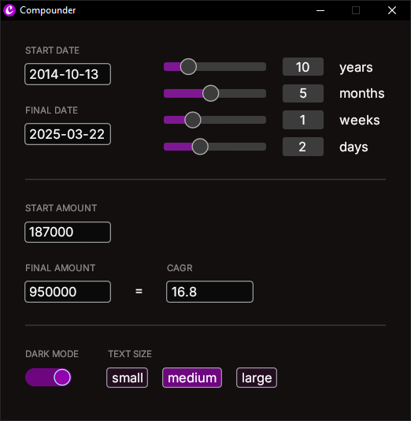

# Compounder
A small application to calculate compound annual growth rate (CAGR) and difference between dates using [egui](https://github.com/emilk/egui) for the user interface and [chrono](https://github.com/chronotope/chrono) for time calculations.

> **DISCLAIMER**: this application is a hobby project and should be used as such. Any other use it at your own risk. It is provided as-is and is not likely to be maintained regularly.

